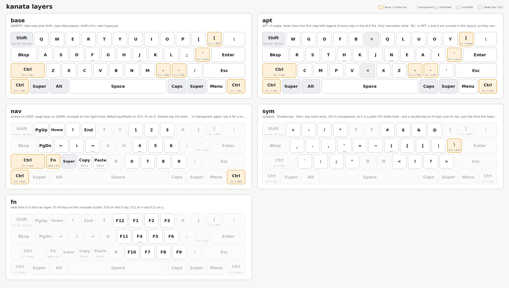

Natapok it's combination symbol layer + navigation layer + APT V3 angle layout with little tweaks 

# For pictures keyboard setup
python3 kanata_render.py kanata.kbd -f both|svg|png

This repository fully created using AI
